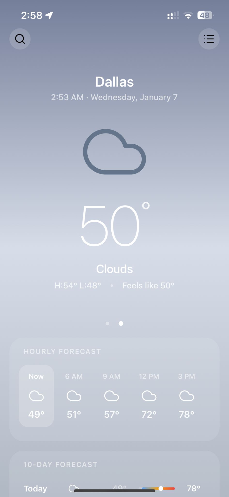
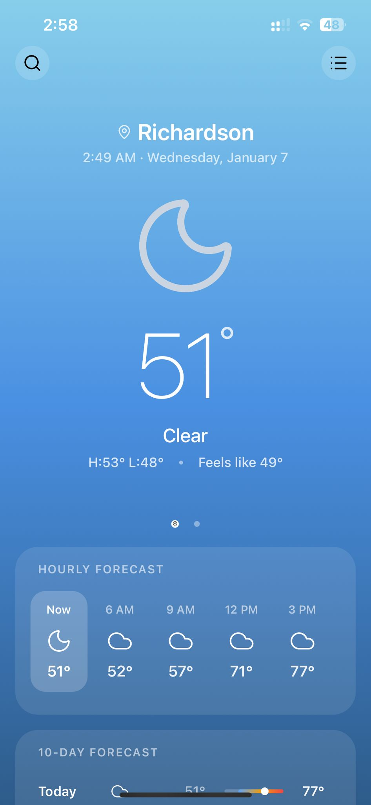
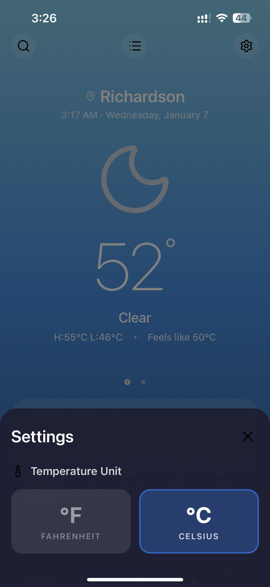

# WeatherWise Native

> **Note**: This project is the spiritual successor and technical evolution of [WeatherWise](https://github.com/soham04/WeatherWise). It represents a significant leap forward in architecture, design, and functional depth, built to demonstrate advanced React Native capabilities.

WeatherWise Native is a premium, aesthetically driven weather application built with **React Native** and **Expo**. It combines real-time weather precision with a dynamic, immersive UI that adapts its color palette to the current sky conditions.

> **Cross-Platform**: Designed and optimized to run flawlessly on **iOS**, **Android**, and **Web**.

## Features

### Core Functionality
- **Real-Time Weather**: Accurate current alerts and conditions using the OpenWeatherMap API.
- **Global Reach**: Search, add, and manage weather for unlimited cities worldwide.
- **Smart Formatting**: Displays time, date, and forecast details in the local timezone of the selected city.
- **Detailed Forecasts**:
  - 24-hour hourly breakdown with precipitation probability.
  - 7-day daily forecast with high/low temperature ranges.
- **Rich Metrics**: Humidity, Wind Speed/Direction, Visibility, Pressure, and Sunrise/Sunset times.

### User Experience
- **Dynamic Gradients**: The entire app background shifts fluidly between custom-curated gradients (e.g., `sunny`, `stormy`, `night-clear`) based on the live weather data.
- **Interactive UI**:
  - Horizontal paging between saved cities with a custom indicator.
  - Smooth modal transitions for search and settings.
  - "Pull to Refresh" functionality implies seamless data updates.
- **Preferences**:
  - Toggle between **Celsius** and **Fahrenheit** instantly.
  - Persistent storage of user preferences and city list.

### Technical Highlights (Upgrade from WeatherWise)
- **Robust State Management**: Migrated to **TanStack Query** (React Query) for efficient caching, background updates, and optimistic UI.
- **Type Safety**: Fully typed codebase using **TypeScript**, ensuring reliability and easier maintenance compared to the original JavaScript implementation.
- **Modern Styling**: Utilizes **NativeWind (Tailwind CSS)** for performant, utility-first styling that keeps the codebase clean.
- **Clean Architecture**: Separation of concerns with dedicated service layers (`weatherService`, `storageService`) and reusable components.

---

## Tech Stack

| Category | Technology |
|----------|------------|
| **Framework** | [React Native](https://reactnative.dev/) / [Expo SDK 50+](https://expo.dev/) |
| **Language** | [TypeScript](https://www.typescriptlang.org/) |
| **State/Data** | [TanStack Query](https://tanstack.com/query/latest) |
| **Styling** | [NativeWind](https://www.nativewind.dev/) (Tailwind CSS) |
| **Navigation** | [Expo Router](https://docs.expo.dev/router/introduction/) |
| **Icons** | [Lucide React Native](https://lucide.dev/) |
| **Storage** | [AsyncStorage](https://react-native-async-storage.github.io/async-storage/) |
| **API** | [OpenWeatherMap](https://openweathermap.org/api) |

---

## Screenshots

<div align="center">
  
  
  
</div>

---

## Installation & Setup

1. **Clone the repository**
   ```bash
   git clone https://github.com/soham04/sky-hue-native.git
   cd sky-hue-native
   ```

2. **Install dependencies**
   ```bash
   npm install
   ```

3. **Environment Setup**
   This project uses `OpenWeatherMap`. The API key is currently configured in `lib/weatherService.ts`. For production, ensure this is moved to a `.env` file.

4. **Run the App**
   Start the Expo development server:
   ```bash
   npm start
   ```

5. **Launch on Device**
   - **iOS**: Press `i` to open in iOS Simulator.
   - **Android**: Press `a` to open in Android Emulator.
   - **Web**: Press `w` to open in the Browser.
   - **Physical Device**: Scan the QR code with the Expo Go app.

---

## Project Structure

```
sky-hue-native/
├── app/                 # Expo Router app directory
├── components/          # Reusable UI components
│   ├── modals/          # Search, List, Settings modals
│   ├── weather/         # Weather-specific views (CityWeatherView, etc.)
│   └── ui/              # Generic UI elements
├── lib/                 # Business logic & services
│   ├── weatherService.ts  # API integration
│   ├── storageService.ts  # Local persistence
│   └── preferencesService.ts
├── styles/              # Global styles & theme configuration
└── assets/              # Static assets (images, fonts)
```

---

## Contributing

Contributions are welcome! Please feel free to submit a Pull Request.

## License

This project is licensed under the MIT License.
